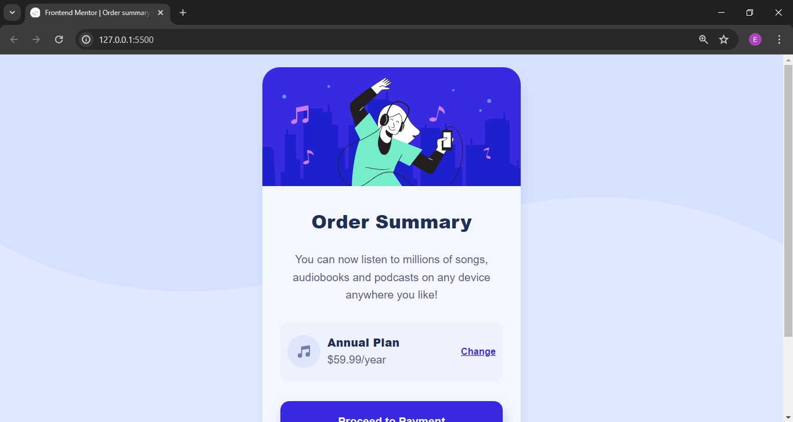

# Frontend Mentor - Order summary card solution

This is a solution to the [Order summary card challenge on Frontend Mentor](https://www.frontendmentor.io/challenges/order-summary-component-QlPmajDUj). Frontend Mentor challenges help you improve your coding skills by building realistic projects. 

## Table of contents

- [Overview](#overview)
  - [The challenge](#the-challenge)
  - [Screenshot](#screenshot)
  - [Links](#links)
- [My process](#my-process)
  - [Built with](#built-with)
  - [What I learned](#what-i-learned)
  - [Continued development](#continued-development)
  - [Useful resources](#useful-resources)
- [Author](#author)

## Overview

### The challenge

Users should be able to:

- See hover states for interactive elements

### Screenshot

Screenshot of my solution. 

### Links

- Solution URL: [Add solution URL here](https://your-solution-url.com)
- Live Site URL: [Add live site URL here](https://emanueltenik.github.io/order-summary-component-main/)

## My process

### Built with

- Semantic HTML5 markup
- CSS custom properties
- Flexbox
- CSS Grid
- Mobile-first workflow

### What I learned

I have learnt to structure HTML properly and organise CSS in a more better way

### Continued development

I appreciate having tried out this project challenge, because it has given me a chance to apply my skills in basic HTML and CSS. 

Am looking forward to doing more practice by taking more challenges so that I expand my knowledge.

### Useful resources

- (https://www.fluid-type-scale.com) - Helped me to apply a basic responsive font-size scale

## Author

- Frontend Mentor - (https://www.frontendmentor.io/profile/emanueltenik)